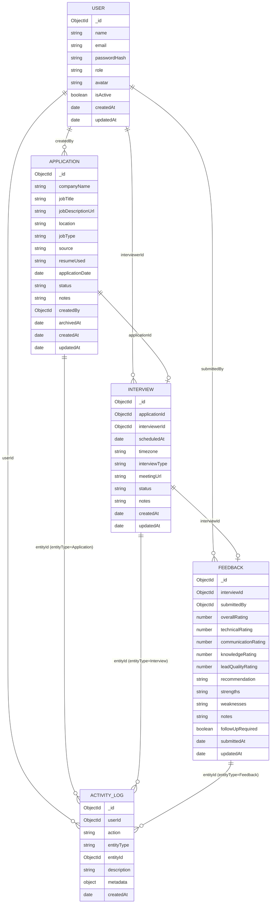

# Architecture — Job Application & Interview Management System

Status: **draft for review** — no implementation code has been written yet. This document
translates `docs/PRD.md` into concrete technical decisions, following the hard rules in
`docs/CLAUDE.md` exactly (`resumeUsed` is a plain string, no resume collection, interviews
always reference an existing application, Sara is scoped to interviews/feedback only, soft
delete over hard delete, activity logging on all important actions).

---

## 1. Database architecture & entity relationships

Five MongoDB collections, all managed through Mongoose schemas. Relationships are expressed
via ObjectId references, not embedding — every list view needs independent pagination/filtering
(server-side, per hard rule 7), which embedding would fight against.



### Relationship notes

- **Application → Interview** (`Interview.applicationId`): required, one-directional
  reference. An Interview cannot exist without a valid `applicationId` (hard rule 2). The
  schema does not force a hard uniqueness constraint on `applicationId` — the normal flow
  produces one interview per application, but nothing prevents a second interview document
  later (e.g. a company restarts the process for the same application) without inventing a
  separate "reapplication" concept. The API layer treats "does this application have an
  active interview" as a query (`Interview.findOne({ applicationId, status: { $ne:
  'Cancelled' } })`), not a schema constraint.
- **Interview → Feedback** (`Feedback.interviewId`): one feedback document per interview,
  enforced with a **unique index** on `interviewId`. `POST /api/interviews/:id/feedback`
  creates it once (only reachable after the interview is `Completed`); subsequent edits go
  through `PATCH /api/feedback/:id`, never a second POST.
- **No embedding of company/job/JD/resume into Interview.** Interview detail views join back
  to `Application` at read time (populate or a service-level lookup) — this is what hard rule
  2 requires structurally, not just at form-fill time.
- **ActivityLog is polymorphic**, referencing any of `Application`, `Interview`, `Feedback`,
  or `User` via `entityType` (enum) + `entityId`. It has no foreign key constraint enforced by
  Mongoose; it is an append-only audit trail, so it must tolerate entities that later change
  independently of it.
- **Status history** (PRD §26) is *not* a separate collection. Every status transition on an
  Application writes an `ActivityLog` entry with `action: "status_changed"` and
  `metadata: { from, to }`. The application timeline (PRD §11) is rendered by querying
  `ActivityLog` filtered to `entityType: "Application", entityId: <id>`, ordered by
  `createdAt`. This avoids a redundant `statusHistory[]` array that could drift from the log.
- **Soft delete**: `Application.archivedAt` (nullable Date). `DELETE /api/applications/:id`
  sets `archivedAt` instead of removing the document (hard rule 4 / PRD §32 rule 7). All
  application list queries default to `archivedAt: null` unless explicitly including
  archived records.

---

## 2. API architecture

REST over JSON, versionless (`/api/...`), one router file per resource. All list endpoints
return a common pagination envelope; all endpoints return a common error envelope.

### Conventions

**Success (list):**
```json
{
  "data": [ /* array of resource objects */ ],
  "pagination": { "page": 1, "limit": 20, "total": 142, "totalPages": 8 }
}
```

**Success (single resource):** the resource object directly under `data`.
```json
{ "data": { "_id": "...", "...": "..." } }
```

**Error:**
```json
{
  "error": {
    "code": "VALIDATION_ERROR",
    "message": "companyName is required",
    "details": [ { "path": "companyName", "message": "Required" } ]
  }
}
```

Standard `code` values: `VALIDATION_ERROR` (400), `UNAUTHENTICATED` (401), `FORBIDDEN` (403),
`NOT_FOUND` (404), `CONFLICT` (409, e.g. duplicate email), `INTERNAL_ERROR` (500).

### Auth — `/api/auth`

| Method | Path | Body | Response |
|---|---|---|---|
| POST | `/login` | `{ email, password }` | `{ data: { token, user } }` — `user` excludes `passwordHash` |
| POST | `/logout` | — (auth required) | `{ data: { success: true } }` |
| GET | `/me` | — (auth required) | `{ data: { user } }` |

### Applications — `/api/applications`

| Method | Path | Notes |
|---|---|---|
| GET | `/` | paginated + filtered, see query params below |
| POST | `/` | create; returns `possibleDuplicate` warning alongside the created record (PRD §25) |
| GET | `/:id` | includes populated `createdBy` (name only) and linked interview summary if one exists |
| PATCH | `/:id` | partial update; status changes and field edits both go through this |
| DELETE | `/:id` | soft delete — sets `archivedAt`, does not remove the document |
| GET | `/:id/activity` | activity timeline for this application (thin wrapper over `/api/activity?entityType=Application&entityId=:id`) |
| GET | `/check-duplicate` | `?companyName=&jobTitle=&jobDescriptionUrl=` → `{ data: { possibleDuplicate: boolean, matches: [...] } }`, used by the Add Application form before submit |

Query params on `GET /`: `page`, `limit`, `search` (partial match across company + title),
`company`, `jobTitle`, `source`, `resumeUsed`, `status`, `startDate`, `endDate`, `createdBy`,
`includeArchived` (bool, default false). All filters are combinable and case-insensitive
partial match (regex-based, anchored to indexed fields — see §8).

**Create/Update body:**
```json
{
  "companyName": "Acme Inc",
  "jobTitle": "Sales Development Rep",
  "jobDescriptionUrl": "https://...",
  "location": "Remote - United States",
  "jobType": "Full-time",
  "source": "LinkedIn",
  "resumeUsed": "Pre-Sales Resume",
  "applicationDate": "2026-08-24",
  "status": "Applied",
  "notes": "Referred by..."
}
```

### Interviews — `/api/interviews`

| Method | Path | Notes |
|---|---|---|
| GET | `/` | paginated + filtered |
| POST | `/` | creates an interview from an existing `applicationId` — this **is** the "Convert to Lead / Schedule Interview" action (PRD §12); it does not duplicate application data |
| GET | `/:id` | includes populated `applicationId` (full application fields per PRD §14) and `interviewerId` (name) |
| PATCH | `/:id` | reschedule (date/time/timezone), change status, edit notes, mark `Completed` |

Query params on `GET /`: `page`, `limit`, `company`, `jobTitle`, `interviewerId`, `status`,
`date`, `startDate`, `endDate`, `rating` (joins `Feedback.overallRating`), `feedbackStatus`
(`pending` | `submitted`, derived — see below), `tab` (`upcoming` | `today` | `past` |
`pending-feedback`, a convenience alias that sets `startDate`/`endDate`/`status`/
`feedbackStatus` server-side to match PRD §13's tab semantics exactly).

**Feedback status** is not a stored field on Interview — it is derived per request:
`Completed` interview + no `Feedback` document with that `interviewId` ⇒ `Feedback Pending`;
`Completed` + a `Feedback` document exists ⇒ `Feedback Submitted`. Computed via a `$lookup`
(aggregation) rather than duplicated/synced state.

**Create body:**
```json
{
  "applicationId": "665f...",
  "interviewerId": "665a...",
  "scheduledAt": "2026-08-25T20:00:00.000Z",
  "timezone": "Asia/Karachi",
  "interviewType": "Video Call",
  "meetingUrl": "https://meet...",
  "notes": ""
}
```
Response includes the populated application snapshot (company, job title, JD URL, source,
resumeUsed) purely as a **read-time join for display** — never persisted onto the Interview
document itself.

### Feedback — `/api/interviews/:id/feedback`, `/api/feedback/:id`

| Method | Path | Notes |
|---|---|---|
| POST | `/api/interviews/:id/feedback` | only allowed when the interview's `status` is `Completed`; 409 if feedback already exists for this interview |
| PATCH | `/api/feedback/:id` | edit an existing feedback record |

**Body:**
```json
{
  "overallRating": 4,
  "technicalRating": 4,
  "communicationRating": 5,
  "knowledgeRating": 3,
  "leadQualityRating": 4,
  "recommendation": "Good Lead",
  "strengths": "...",
  "weaknesses": "...",
  "notes": "...",
  "followUpRequired": true
}
```

### Dashboard — `/api/dashboard`

| Method | Path | Notes |
|---|---|---|
| GET | `/summary` | role-aware — the same endpoint returns different shapes for APPLICANT / INTERVIEWER / ADMIN based on the caller's JWT role (see §6/§18 field lists in PRD), computed server-side, never by the client fetching full collections |
| GET | `/analytics` | ADMIN only; accepts `?range=day\|week\|month` and returns the chart-ready datasets for PRD §18 (applications over time / by source / by resume / by status, lead conversion, interview funnel, KPI values) |

### Activity — `/api/activity`

| Method | Path | Notes |
|---|---|---|
| GET | `/` | paginated; `?userId=&action=&entityType=&startDate=&endDate=` — powers both an application's own timeline and Umair's Team Activity page |

### Users — `/api/users`

| Method | Path | Notes |
|---|---|---|
| GET | `/` | ADMIN only (also used by Abdullah's app to populate the "Interviewer" select when scheduling — a restricted `?role=INTERVIEWER` projection returning only `_id`/`name` is exposed to non-admins) |
| PATCH | `/:id` | ADMIN only — activate/deactivate, change role, update name |

---

## 3. Authentication & authorization strategy

### JWT flow

1. `POST /api/auth/login` — validate `{ email, password }`, look up `User` by email
   (`isActive: true`), compare `password` against `passwordHash` with bcrypt.
2. On success, sign a JWT with payload `{ sub: user._id, role: user.role }`, expiry from
   `JWT_EXPIRES_IN` (config, default e.g. `7d`), secret from `JWT_SECRET`.
3. Response returns `{ token, user }` — `user` is the Mongoose doc with `passwordHash`
   stripped (`toJSON` transform on the User model removes it globally, so it's impossible to
   leak it from *any* endpoint, not just login).
4. Client stores the token (auth context/hook, PRD §1.4) and an Axios request interceptor
   attaches `Authorization: Bearer <token>` to every request.
5. `POST /api/auth/logout` is a client-driven token discard; the endpoint exists for symmetry
   and as the extension point for future server-side revocation (e.g. a token blacklist) — it
   is a stateless no-op today, matching "JWT authentication" as scoped in the PRD (no
   refresh-token rotation is specified).
6. `GET /api/auth/me` re-validates the token and returns the current user — used on app load
   to restore session state and confirm the role hasn't changed since the token was issued.

### Middleware pipeline (applied per route)

```
request
  → authenticate         (verifies JWT signature + expiry, loads req.user = { id, role },
                           optionally re-checks User.isActive on sensitive routes)
  → authorize(...roles)   (403 if req.user.role not in the allowed list for this route)
  → validate(schema)      (Zod schema for params/query/body; 400 on failure)
  → controller → service  (resource-level / ownership scoping happens here, see §4)
```

- `authenticate` is applied globally to every `/api/*` route except `POST /api/auth/login`.
- `authorize(...roles)` is a small middleware factory (`authorize('ADMIN')`,
  `authorize('ADMIN', 'INTERVIEWER')`, etc.) applied per-route in the router files — this is
  what makes the role/permission matrix in §4 auditable by reading the routes file rather
  than being scattered through controllers.
- **Ownership scoping** (e.g. "an INTERVIEWER can only see interviews assigned to them") is
  *not* expressible as a role check alone, so it lives in the service layer: every
  list/detail query for a non-admin caller is constrained by an additional filter derived
  from `req.user` (`interviewerId: req.user.id` for Sara's interview queries; Abdullah has no
  such extra constraint today since he's the sole APPLICANT, but the filter exists in the
  service layer so a second applicant account works without a rewrite).
- Passwords are never logged, never included in JWT payload, never returned by any endpoint.

---

## 4. Role / permission matrix

Legend: **C**reate · **R**ead · **U**pdate · **D**elete/Archive · — not permitted.
"Own" = scoped to records the user created or is assigned to; "All" = unscoped.

| Resource | APPLICANT (Abdullah) | INTERVIEWER (Sara) | ADMIN (Umair) |
|---|---|---|---|
| Applications | C, R (Own), U (Own), D/Archive (Own) | R (Own, read-only — only applications tied to interviews assigned to them, via join) | C, R, U, D/Archive (All) |
| Interviews | C (schedule, from own application), R (Own) | R (Own, assigned only), U (Own — status, notes, mark Completed) | C, R, U (All) |
| Feedback | R (Own, read-only, via their applications) | C, R, U (Own — interviews assigned to them) | R, U (All) |
| ActivityLog | R (scoped to entities they created) | R (scoped to entities they touched) | R (All — Team Activity page) |
| Dashboard summary | R (Own numbers) | R (Own numbers) | R (All numbers) |
| Analytics | — | — | R |
| Users | R (self only, via `/auth/me`) | R (self only) | C\*, R, U (All) |

\* User creation (onboarding a 4th team member) is not an explicit PRD requirement for
Phase 1–6; the matrix reserves it for ADMIN if/when a "create user" action is added — until
then users are provisioned via the seed script (PRD §31).

Notes:
- Sara never creates or edits an Application, and never sees Abdullah's applications that
  have no interview attached — enforced at the service layer, not just hidden in the UI
  (hard rule 3 / PRD §1 "Not responsible for Abdullah's applications").
- Abdullah can view interview and feedback data tied to *his own* applications (read-only),
  since PRD §1 lists "View leads/interviews" as one of his permissions and application
  detail pages show the related interview (PRD §11). He cannot edit interview scheduling
  fields after creation beyond what's needed to reschedule his own interview request, and
  he never edits feedback content.
- ADMIN bypasses every ownership filter described in §3 — the service layer treats
  `role === 'ADMIN'` as "no additional scoping clause."

---

## 5. Page / route structure per role (frontend)

React Router, with a top-level `ProtectedRoute` (must be authenticated) and a nested
`RoleRoute(...roles)` guard. Unauthorized access redirects to `/dashboard` (or `/login` if
unauthenticated), never a blank/broken page.

```
/login                          public

/dashboard                      all roles — renders role-specific dashboard widgets

# Abdullah (APPLICANT)
/applying                       Applying Jobs — Today's Applying, Today's Progress, Add Application
/applications                   Jobs Applied — full history, grouped by date, search/filter/pagination
/applications/:id                Application details — fields, timeline, related interview
/leads                          Leads & Interviews (Upcoming/Today/Past/Pending Feedback tabs) — read-only lens on his own
/leads/:id                      Interview details (read-only for Abdullah)
/activity                       Activity — scoped to his own actions/entities

# Sara (INTERVIEWER)
/interviews/mine                My Interviews
/interviews/upcoming            Upcoming Interviews
/interviews/past                Past Interviews
/interviews/:id                 Interview details + Mark Completed + Add/Edit Feedback
/feedback/pending               Pending Feedback list
/activity                       Activity — scoped to her own actions/entities

# Umair (ADMIN)
/applications                   Jobs Applied (all applicants' records)
/applications/:id                Application details (full access)
/leads                          Leads & Interviews (all interviews)
/leads/:id                      Interview details (full access)
/analytics                      Analytics
/team-activity                  Team Activity (all users, filterable)

# Shared / optional
/calendar                       Optional calendar page (PRD §21) — visible to all roles, scoped by role like /leads
```

Sidebar nav items are driven by a single `NAV_CONFIG` keyed by role (matching PRD §5 exactly),
so adding a role or reordering nav never touches route-guard logic.

---

## 6. Frontend component structure (`client/src`)

```
client/src/
├── main.tsx, App.tsx, router.tsx
├── components/
│   ├── ui/              # design-system primitives: Button, Input, Select, Modal, Toast,
│   │                     # StatusBadge, Table, Pagination, EmptyState, Spinner, ConfirmDialog
│   ├── layout/           # Sidebar, Topbar, AppShell, RoleAwareNav
│   └── charts/            # thin Recharts wrappers used by analytics (BarChart, LineChart, DonutChart)
├── layouts/
│   ├── AuthLayout.tsx     # centered card, used by /login
│   └── DashboardLayout.tsx # Sidebar + Topbar + <Outlet/>, used by everything post-login
├── pages/                # one file per route in §5, composed from features/ below —
│                          # pages stay thin: data fetching hook + feature components
├── features/
│   ├── auth/              # LoginForm, useAuth, session bootstrap
│   ├── applications/       # ApplicationForm, ApplicationTable, ApplyingJobsPanel,
│   │                        # DuplicateWarningBanner, ApplicationTimeline, StatusBadge mapping
│   ├── interviews/          # ScheduleInterviewForm (Convert to Lead), InterviewTable,
│   │                         # InterviewTabs (Upcoming/Today/Past/Pending Feedback), InterviewDetailCard
│   ├── feedback/             # FeedbackForm, RatingInput, RecommendationSelect
│   ├── dashboard/             # per-role widget sets: ApplicantDashboard, InterviewerDashboard, AdminDashboard
│   ├── analytics/              # AnalyticsFilters + chart sections matching PRD §18
│   ├── activity/                # ActivityTimeline, ActivityFilters (used by both /activity and /team-activity)
│   └── notifications/            # NotificationBell, NotificationList (in-app only, PRD §20)
├── hooks/                # cross-cutting hooks: usePagination, useDebouncedFilter, useRoleGuard
├── services/              # api/ — one module per resource (applications.api.ts,
│                          # interviews.api.ts, feedback.api.ts, dashboard.api.ts,
│                          # activity.api.ts, auth.api.ts), plus the shared axios instance
├── context/                # AuthContext (JWT/user/role), ToastContext
├── types/                  # shared TS types/interfaces mirroring backend response shapes
└── utils/                  # date/timezone formatting, status-badge color maps, query-string helpers
```

Data fetching is TanStack Query throughout — `services/` holds pure Axios calls, `features/*`
hold the `useQuery`/`useMutation` hooks that call them, `pages/` just compose. Forms use React
Hook Form + Zod resolvers, with the same Zod field shapes mirrored (not shared at build time,
since client/server are separate packages) from the backend validators.

---

## 7. Backend folder structure (`server/src`)

```
server/src/
├── config/           # env.ts (validated env loading), db.ts (Mongoose connection), cors.ts
├── models/            # User.ts, Application.ts, Interview.ts, Feedback.ts, ActivityLog.ts
│                       # each defines schema, indexes (§8), toJSON transforms (strip passwordHash)
├── routes/             # auth.routes.ts, applications.routes.ts, interviews.routes.ts,
│                        # feedback.routes.ts, dashboard.routes.ts, activity.routes.ts,
│                        # users.routes.ts, index.ts (mounts all under /api)
├── controllers/         # one per resource — parse req, call service, shape response envelope;
│                         # no business logic or Mongoose queries live here
├── services/              # applications.service.ts, interviews.service.ts, feedback.service.ts,
│                           # dashboard.service.ts, activity.service.ts, auth.service.ts,
│                           # users.service.ts — all business logic, ownership scoping (§3/§4),
│                           # duplicate detection (§25), activityLog writes (hard rule 5)
├── middleware/             # authenticate.ts, authorize.ts, validate.ts, errorHandler.ts,
│                            # rateLimiter.ts (login), notFound.ts
├── validators/               # Zod schemas per resource, shared by validate.ts middleware
├── utils/                     # jwt.ts (sign/verify), password.ts (bcrypt hash/compare),
│                              # activityLogger.ts (single helper every service calls to write
│                              # ActivityLog entries consistently), pagination.ts, dateRange.ts
├── types/                      # req.user augmentation, shared DTO/response types
├── seed/                        # seed.ts (PRD §31) — dev users + sample data, run via npm script
└── app.ts, server.ts             # Express app assembly vs. HTTP listener (split for testability)
```

`activityLogger.ts` is deliberately a single shared utility, not duplicated per service —
every service that mutates Application/Interview/Feedback calls
`logActivity({ userId, action, entityType, entityId, description, metadata })` so activity
logging can't be silently forgotten on a new endpoint (hard rule 5).

---

## 8. MongoDB indexes

Per PRD §24, plus compound indexes derived from the actual query patterns above (Today's
Applying, Jobs Applied filters, interview tabs, activity timelines).

**`applications`**
| Index | Type | Purpose |
|---|---|---|
| `{ companyName: 1 }` | single | filter/search by company |
| `{ jobTitle: 1 }` | single | filter/search by job title |
| `{ applicationDate: -1 }` | single | default sort, date-range filters |
| `{ status: 1 }` | single | status filter |
| `{ source: 1 }` | single | source filter, analytics grouping |
| `{ resumeUsed: 1 }` | single | resume filter, analytics grouping |
| `{ createdBy: 1, applicationDate: -1 }` | compound | Today's Applying / per-applicant history (main access pattern for PRD §7 & §8) |
| `{ createdBy: 1, status: 1 }` | compound | dashboard counts by status per user |
| `{ archivedAt: 1 }` | single | excluding archived records from default list queries |
| `{ companyName: 1, jobTitle: 1, jobDescriptionUrl: 1 }` | compound | duplicate detection lookup (PRD §25) |

Partial-match search (company/title) uses case-insensitive regex against the indexed
`companyName`/`jobTitle` fields rather than a `$text` index, since PRD §8 specifies partial
matching (substring), which `$text` (token-based) doesn't do well; regex on an indexed field
with anchored prefix search is the pragmatic fit at this data scale.

**`interviews`**
| Index | Type | Purpose |
|---|---|---|
| `{ applicationId: 1 }` | single | required per hard rule 2; also enforces the "does this application already have an interview" check |
| `{ interviewerId: 1 }` | single | Sara's "My Interviews" |
| `{ scheduledAt: 1 }` | single | date-range filters, calendar view |
| `{ status: 1 }` | single | status filter, Upcoming/Past tab logic |
| `{ interviewerId: 1, scheduledAt: 1 }` | compound | Sara's Upcoming/Today/Past tabs (main access pattern) |
| `{ status: 1, scheduledAt: 1 }` | compound | admin-wide Upcoming/Today/Past across all interviewers |

**`feedback`**
| Index | Type | Purpose |
|---|---|---|
| `{ interviewId: 1 }` | **unique** | one feedback record per interview; also backs the Pending/Submitted feedback-status join |

**`activityLogs`**
| Index | Type | Purpose |
|---|---|---|
| `{ userId: 1, createdAt: -1 }` | compound | a user's own activity, most-recent-first |
| `{ createdAt: -1 }` | single | Team Activity global timeline |
| `{ entityType: 1, entityId: 1, createdAt: -1 }` | compound | an entity's own timeline (Application/Interview detail pages) |

**`users`**
| Index | Type | Purpose |
|---|---|---|
| `{ email: 1 }` | **unique** | login lookup, uniqueness constraint |
| `{ role: 1 }` | single | filtering the interviewer picker, admin user list |

---

## Open questions for review

1. **Second applicant/interviewer accounts**: the design above already scopes by
   `createdBy`/`interviewerId` rather than hardcoding "Abdullah"/"Sara", so adding a second
   APPLICANT or INTERVIEWER later needs no schema change — confirm that's desired now vs.
   intentionally hardcoding for a 3-person team.
2. **JWT storage on the client** (localStorage vs. httpOnly cookie): PRD §1.4 phrasing
   ("auth context/hook storing the JWT", "Axios instance that attaches the token") points to
   a Bearer-token/localStorage pattern, which is simpler but more exposed to XSS than an
   httpOnly cookie. Flagging the tradeoff — happy to switch to a cookie-based flow if
   preferred before Phase 1 auth work starts.
3. **Interview ⇄ Application cardinality**: confirmed above as "not hard-enforced unique,"
   but the UI should probably still discourage scheduling a second interview from an
   application that already has an active one. Confirm that's a UI-level nudge, not a hard
   API rejection.
